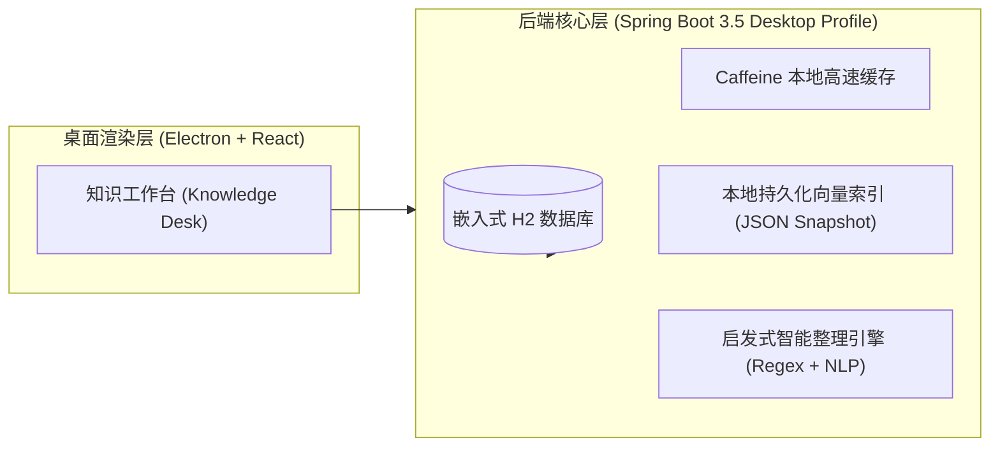

# AI Agent Knowledge Desk - macOS 闭环使用与无模型运行指南

## 一、 核心特性与架构模式

本系统专为 macOS（Apple Silicon M 系列及 Intel 架构）设计，提供了 **100% 零外部大模型依赖的 Local-First 纯本地闭环**：



---

## 二、 macOS 常用操作命令

### 1. 极速一键全栈拉起 (纯本地零模型依赖模式)
```bash
./scripts/run-macos-local.sh
```
- **执行效果**：自动自检 macOS 硬件与运行时环境，并发启动 Spring Boot Desktop 后端（H2）并自动拉起 Electron 桌面窗口。
- **退出方式**：在终端直接按 `Ctrl+C` 自动优雅停止并清理全部进程。

### 2. 独立 macOS 原生安装包构建 (.dmg)
```bash
./scripts/package-macos-local.sh
```
- **执行效果**：使用 `jlink` 自动裁剪内嵌 Java 21 JRE（无需用户电脑安装 Java），并使用 Electron Builder 输出原生 macOS arm64 `.dmg` 安装包，输出位于 `desktop/release/`。
