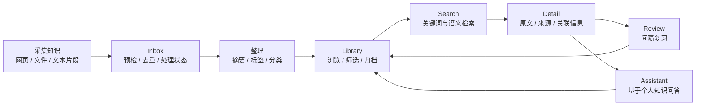
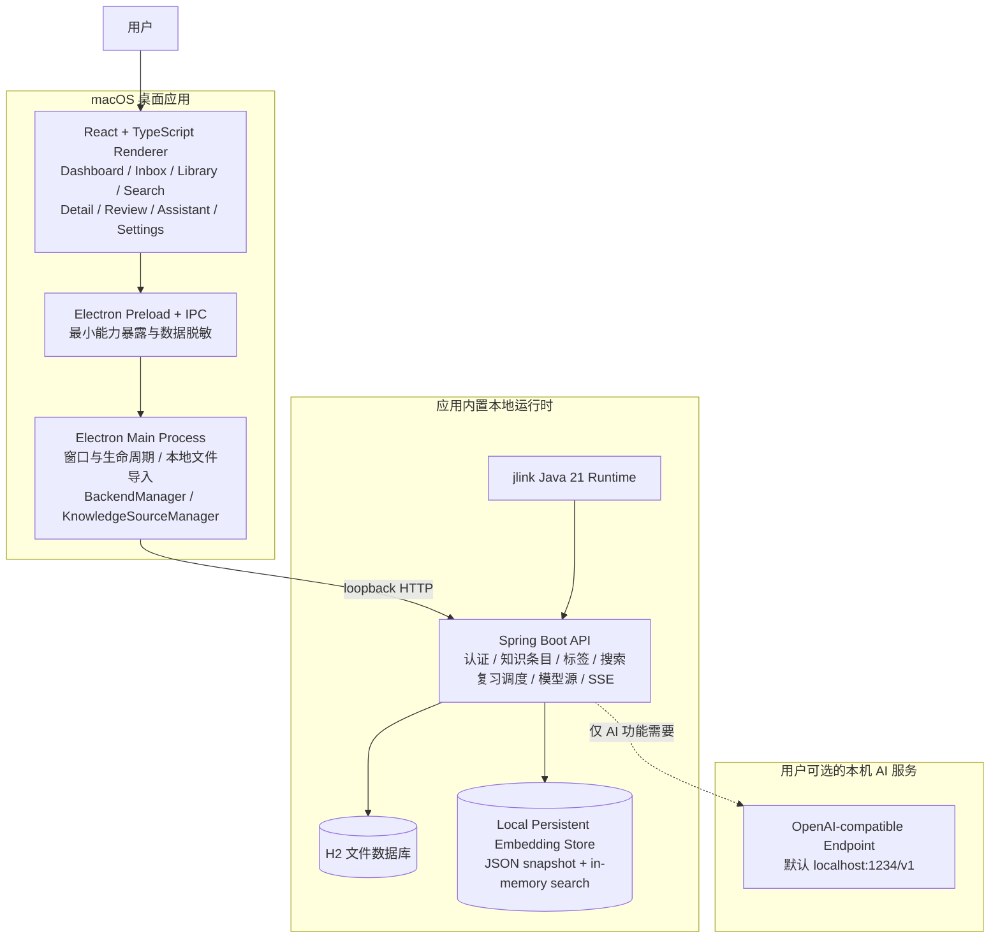
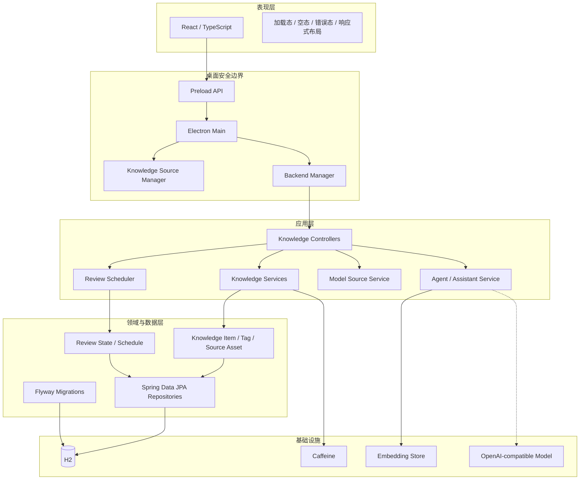
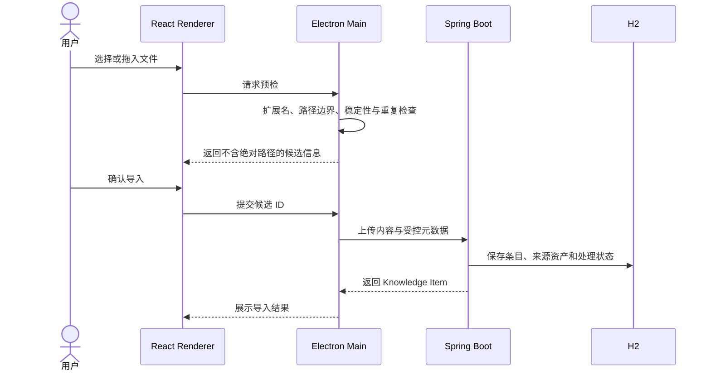
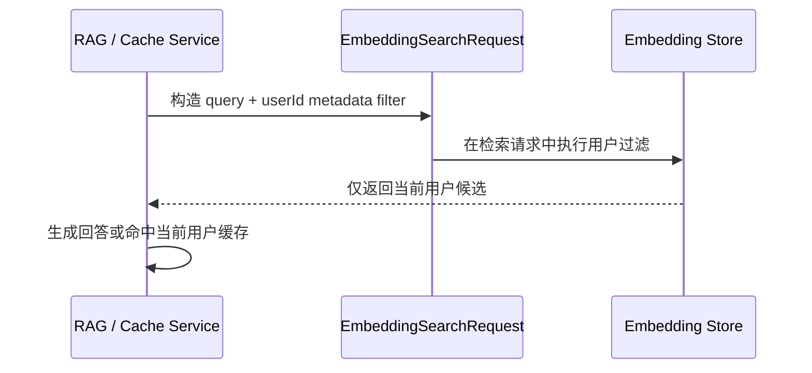
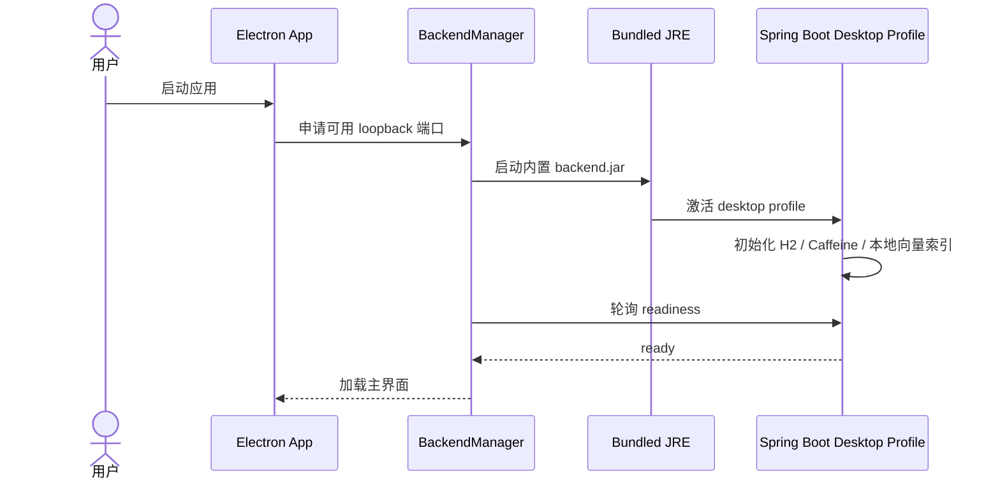

# AI Agent Knowledge Desk — 产品与技术架构说明

> 面向简历、项目答辩和技术面试的事实版项目说明。主产品是可独立启动的 macOS Knowledge Desk 桌面应用；仓库中的 CLI、Dev Coach 与云端部署栈属于扩展能力。

## 1. 一句话定位

AI Agent Knowledge Desk 是一款 Local-First 的个人知识工作台：用户可以导入网页、文件和文本片段，在 Inbox 中整理内容，通过标签、搜索和每日复习重新利用知识；AI 整理与助手能力通过用户自己配置的本机 OpenAI-compatible 模型提供。

## 2. 产品闭环

这条链路解决的不是“再做一个聊天框”，而是让零散资料经历采集、整理、检索、复习和再利用，形成可持续的个人知识循环。

## 3. 产品架构图

### 为什么这样拆分

- Renderer 只负责交互与状态展示，不直接获得任意文件系统能力。
- Electron Main Process 负责本地文件选择、路径校验、导入桥接和后端进程生命周期，缩小前端被注入时的影响范围。
- Spring Boot 保持业务规则、鉴权、数据一致性和 API 协议的单一来源。
- 桌面包内置 JRE 与后端 JAR，普通知识管理不要求用户安装 Java、PostgreSQL 或 Docker。
- AI 服务保持可替换，模型不可用时不阻塞知识库的基础读写和检索流程。

## 4. 分层技术架构

## 5. 三条核心链路

### 5.1 本地文件导入

设计重点：绝对路径和内容哈希留在可信边界内；批量导入先整体预检；文件在预检后被删除或发生变化时返回可理解且不泄露路径的错误。

### 5.2 多用户 RAG 与语义缓存隔离

关键点不是检索后在 Java 内存中再过滤，而是把 `userId` 条件下推到向量检索请求，避免其他用户内容先进入候选集或语义缓存命中路径。

### 5.3 独立桌面启动

## 6. 关键工程决策

### Local-First，而不是默认云端 SaaS

- 个人资料优先保存在本机，降低部署和隐私门槛。
- 桌面 Profile 使用 H2、Caffeine 和本地持久化向量索引；PgVector 关闭或不可用时，主知识索引写入 `${app.data-dir}/vector-store/engineering_memory.json`（可由 `DESKTOP_VECTOR_STORE_DIR` 覆盖），避免把 PostgreSQL、Redis、Milvus 变成启动前置条件。
- 索引沿用内存检索语义，并在每次变更后以临时文件替换 JSON 快照；快照损坏时保留为 `.corrupt-<timestamp>` 并以空索引恢复，落盘失败时当前进程继续提供内存检索。语义缓存仍是瞬态缓存。
- 代价是当前单机模式不适合多设备实时同步，也尚未给出海量向量、跨进程并发或检索质量/延迟的性能承诺。

### 单体后端作为桌面主路径，可选微服务作为扩展

- 桌面主路径使用一个 Spring Boot 后端，减少本地进程数量和故障面。
- 仓库保留 Router、Retrieval、Generation、Reflection 等实验性/扩展模块，但面试时不应把它们说成 Beta 桌面版必经链路。

### 安全边界前移到 Electron Main

- Renderer 不接收原始文件绝对路径和内容哈希。
- 路径穿越、外部符号链接、重复审批和不安全命令均有针对性测试。
- 打包版本不能通过环境变量重新启用遗留 Computer Use 能力。

### 可发布性作为功能的一部分

- 使用 `jlink` 打包 Java 21 运行时，并验证 `jdk.unsupported` 等 Spring 代理运行所需模块。
- 发布资产包含 DMG、ZIP、`release-manifest.json` 与 `SHA256SUMS`。
- 个人 Beta 使用 ad-hoc 签名；正式版本仍保留 Developer ID、notarization 与 Gatekeeper 的严格门禁。

## 7. 已实现功能与边界

### 已实现

- 网页、文件、文本片段导入与预检
- Inbox 状态管理、失败重试、批量整理
- Library 浏览、标签、筛选、归档与恢复
- 全局搜索、详情页、来源信息与摘要
- 每日复习队列与反馈调度
- 本机模型源配置、连接测试和 Knowledge Assistant
- 主知识向量索引的本地持久化、重启恢复与损坏快照隔离
- 非敏感知识库备份与合并恢复
- 独立 macOS arm64 打包与在线 Beta 发布

### 明确边界

- AI 功能需要用户自己运行本机 OpenAI-compatible 模型；没有模型时基础知识管理仍可用。
- 当前 Beta 是个人作品集版本，不宣称已经过企业生产流量验证。
- Beta.2 为 ad-hoc 签名，不等于 Apple Developer ID 签名或公证。
- 桌面主路径不依赖 Docker；云端 Compose/Kubernetes 是可选部署形态。
- 覆盖率只描述后端 JaCoCo 范围；当前开发基线与已发布 Beta 的证据分开记录，不使用“高覆盖率”这类模糊宣传语。
- 当前 `main` 的包内资源布局与 Renderer 降级契约已有自动测试；候选提交仍需在修复本机 Electron 运行时后重新生成安装包，并完成一次真实 GUI 启动 smoke，才能称为新 Beta 的安装包证据。

## 8. 可验证交付证据

### 已发布版本（不可变证据）

- 发布版本：`v0.1.0-beta.2`
- 发布提交：`fd5f26d31f961fcf0e2b79022ff9e5438c6f20b1`
- GitHub Release：<https://github.com/lqq151510/Ai-Agent/releases/tag/v0.1.0-beta.2>
- 发布资产：macOS arm64 DMG、ZIP、manifest 与 SHA-256 校验清单

该 tag 和资产只证明发布来源、平台与签名边界；没有对应的不可变测试归档时，不把任何当前测试或覆盖率数字归因给它。

### 当前主线候选基线（2026-08-27，非发布证据）

- 源代码边界：`main` 提交 [`344b740`](https://github.com/lqq151510/Ai-Agent/commit/344b7402af76f20d1898cd4c68cd8ba3e14045fc)，已推送；该提交没有 `v0.1.0-beta.3` tag 或 GitHub Release。
- 命令：`mvn --settings .mvn/settings.xml -pl backend -am clean verify`。
- `backend`：344 tests run，0 failures，0 errors，9 skipped；前置 `bug-sentinel-starter` 另有 4 项测试全部通过。
- JaCoCo：Lines 5543/7256（76.39%），Branches 1649/2623（62.87%）；Maven `verify` 实际执行全局行 ≥65%、分支 ≥60% 双门禁。
- 该结果可展示已推送的主线质量基线，但不是 Beta.2 的发布结论，也不能在完成候选安装包、GUI smoke、tag 和 Release 前称为新 Beta 发布结果。

更细的证据和复现命令见 [`docs/portfolio/EVIDENCE.md`](docs/portfolio/EVIDENCE.md)。

## 9. 面试中的推荐表达

> 我做的不是一个单纯的聊天 UI，而是一套可独立启动的个人知识工作台。它用 Electron 和 React 提供桌面体验，用 Spring Boot 管理知识条目、标签、复习和模型源；桌面包内置 Java 运行时和 H2，所以不需要用户另装 Java、数据库或 Docker。AI 是可选增强能力，通过本机 OpenAI-compatible 服务接入。项目里我重点解决了 Electron 文件边界、多用户 RAG 隔离、桌面独立启动和可验证发布四个工程问题。

面试话术、追问与演示流程见 [`RESUME_PROJECT_GUIDE.md`](RESUME_PROJECT_GUIDE.md)。
